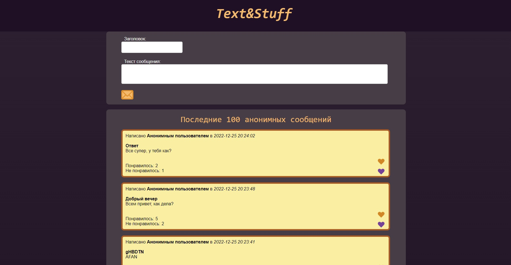
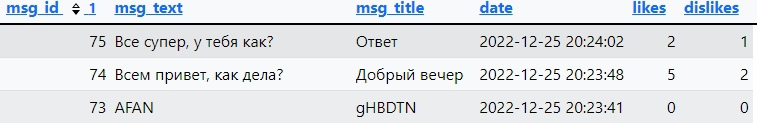

# Отчёт к лабораторной работе №2
## По курсу "Основы программирования"
[Ссылка на репозиторий на github][]

[Ссылка на репозиторий на github]: 
# Реализация шаблона CRUD
***
## Цель работы
Разработать и реализовать клиент-серверную информационную систему, реализующую механизм CRUD
***
## Задание
Система предназначена для анонимного общения в сети интернет.

Интерфейс системы представляет собой веб-страницу с лентой заметок, отсортированных в обратном хронологическом порядке и форму добавления новой заметки. В ленте отображаются последние 100 заметок.

##### Реализованные возможности пользователей:
- добавление текстовых заметок в общую ленту
- реагирование на чужие заметки (лайки)

***
## Пользовательский интерфейс
Главная страница форума

## Пользовательские сценарии работы
1. В случае, если пользователь не вводит сообщение или заголовок и нажимает кнопку "отправить" - на экране появляется сообщение "Для отправки сообщения необходимо заполнить обе ячейки" и комментарий не выгружается на сайт. 
2. Пользователь вводит сообщение и заголовок, нажимает кнопку в виде письма, чтобы отправить комментарий - комментарий успешно загружается и попадает наверх списка, остальные сообщения сдвигаются вниз.
## Описание API сервера и  его хореографии
Сервер использует HTTP POST запросы для выгрузки комментариев в базу данных.
1. Алгоритм отправки сообщения - после проверки на заполненность полей с заголовком и комментарием в базу данных отправляется запрос, добавляющий комментарий в БД с учётом даты его отправки, текстом заголовка и текстом сообщения. Если проверка пройдена не была, поступит уведомление о необходимости заполнить оба доступных поля.
2. Алгоритм вывода комментариев на экран форума - в базу данных отправляется запрос, по которому берутся 100 последних комментариев, они выводятся на экран в порядке убывания их "msg_id", так, что более новые комментарии оказываются сверху.
3. Алгоритм добавления лайка - при нажатии на кнопку "Like" на определённом сообщении страница обновляется и счётчик "Понравилось: N", где N - число лайков, возрастает на единицу.

## Описание структуры базы данных
Для администрирования сервера MySQL и просмотра содержимого базы данных используется браузерное приложение phpMyAdmin. Используется 6 столбцов:
1. "msg_id" типа int с автоматическим приращением для выдачи уникальных id каждому сообщению,
2. "msg_title" типа text для хранения заголовка комментария, 
3. "msg_text" типа text для хранения сообщения комментария,
4. "date" типа datetime для хранения даты и времени отправки сообщения на сайт,
5. "likes" типа int для хранения числа лайков на этом сообщении.
6. "dislikes" типа int для хранения числа дизлайков на этом сообщении.

Пример того, как данные пользователей выглядят в базе данных.


## Значимые фрагменты кода
1. Алгоритм отправки комментария в базу данных
```
function setComment() {
    require("connection.php");
    if(isset($_POST['commentSubmit'])) {
        $date = $_POST['date'];
        $title = $_POST['msg_title'];
        $message = $_POST['msg_text'];
        if (!empty($title) && !empty ($message)) {
            $date = $_POST['date'];
            $title = $_POST['msg_title'];
            $message = $_POST['msg_text'];
            $query = "INSERT INTO messages (date, msg_title, msg_text) VALUES ('$date', '$title', '$message')";
            $result = mysqli_query($con, $query);
        }
        else {
            echo "<br><b><div class ='comment'>Для отправки сообщения необходимо заполнить обе ячейки.</div></b>";
        }
    }
}
```
2. Алгоритм вывода комментариев на сайт
```
function getComments($page_count) {
    require("connection.php");
    $query = "SELECT * FROM messages ORDER BY msg_id DESC LIMIT 100";
    $result = mysqli_query($con, $query);
    while ($row = mysqli_fetch_assoc($result)) {   
        echo "<div class='comment'>
                <div> Написано <b>Анонимным пользователем</b> в <i>".$row['date']."</i><br><br><b>".$row['msg_title']."</b></div>";

        echo " <div>".$row["msg_text"]."</div>";

        echo "<div><br><form method='POST' action='".likeSubmit($row)."'>  <button type='submit' name='".$row['msg_id']."' class='like_button'></button>  <br>Понравилось: ".$row["likes"]."</form></div>

        <div><form method='POST' action='".dislikeSubmit($row)."'>  <button type='submit' name='".$row['msg_id']."' class='dislike_button'></button>Не понравилось: ".$row["dislikes"]."</form></div>

        </div><br>";
    }
}
```
3. Функции добавления лайка и дизлайка на комментарий
```
function likeSubmit($row) {
    require("connection.php");
    if(isset($_POST[$row['msg_id']])) {
        $id = $row['msg_id'];
        $likes = $row['likes']+1;
        $query = "UPDATE messages SET likes = '$likes' WHERE msg_id = '$id'";
        $result = mysqli_query($con, $query);
        header('Location: index.php');
        exit;
    }
}
```
```
function dislikeSubmit($row) {
    require("connection.php");
    if(isset($_POST[$row['msg_id']])) {
        $id = $row['msg_id'];
        $dislikes = $row['dislikes']+1;
        $query = "UPDATE messages SET dislikes = '$dislikes' WHERE msg_id = '$id'";
        $result = mysqli_query($con, $query);
        header('Location: index.php');
        exit;
    }
}
```